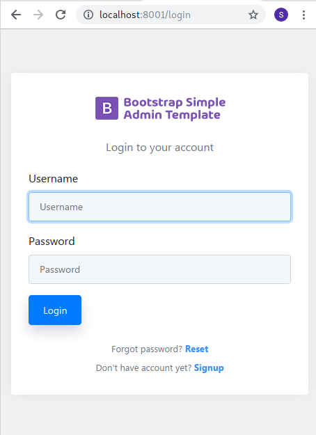
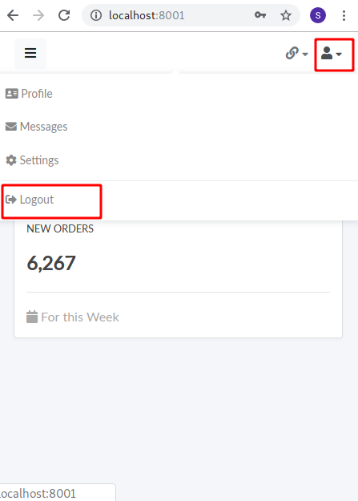

# AIM of this project. Using docker create a simple webpage for login and logout

for creating users and others use admin







# SERVER BOTTLE NECK1: IMPORTANT: DOCKER SETUP LOG ROTATION ELSE THE LOGS FILES WILL GROW AND LEFT WITH NO SPACE

>By default, Docker captures the standard output (and standard error) of all your containers, and writes them in files using the JSON format.

By default, the stdout and stderr of the container are written in a JSON file located in 

```
/var/lib/docker/containers/[container-id]/[container-id]-json.log`
```
If you leave it unattended, it can take up a large amount of disk space, as shown below.

## Solution system wide
 
Add this into your `/etc/docker/daemon.json` to cap your container logs to 1gb (100x 10mb files):

`/etc/docker/daemon.json` needs to be created. By default it does not exist

sudo vi /etc/docker/daemon.json

```
{
  "log-driver": "json-file",
  "log-opts": {
    "max-size": "10m",
    "max-file": "100"
  }
}

```

after this stop all the containers and restart the docker

```
docker stop $(docker ps -a -q)
sudo systemctl daemon-reload
sudo systemctl restart docker
```

## solution dockercompose

```
version: '3'
services:
    app:
        ...
        logging:
            driver: "json-file"
            options:
                max-size: "10m"
                max-file: "100"
```


# SERVER BOTTLE NECK: DONT DELETE THE FOLDER DO_NOT_DELETE_postgres_data

DO_NOT_DELETE_postgres_data  stored the postgresql database.


# steps to put in aws

00) create the following folder structure

BoilerProject/
├── DO_NOT_DELETE_Jupyter_notebooks_on_server
└── DO_NOT_DELETE_postgres_data


0) create project folder in aws
```
mkdir BoilerProject (if not exists)
cd BoilerProject

mkdir DO_NOT_DELETE_Jupyter_notebooks_on_server
mkdir DO_NOT_DELETE_postgres_data

```
2) git clone

```
git clone https://github.com/sant527/Boiler_Max.git

or create a ssh key using ssh-keygen and the use .pub to create a new key in github settings
and then get using

git clone git@github.com:sant527/Boiler_Max.git

```


enter the credentials

this will create a folder Boiler_max


for git to now asking password

get the public ssh key on the pc from where we want to acces git

```
cat ~/.ssh/id_rsa.pub

and place it in the https://github.com/settings/keys

```


3) cd into Boiler_max


# Build image with name django:python-3.7.9-buster from python_django/docker_build/Dockerfile_buster
***********(TO BE DONE AFTER DOWNLOADING THE REPO)***********
```sh
# Shift to the directory python_django/docker_build
# build the image 
# execute the command from Boiler_max directory

cd python_django/docker_build/; docker build -t django:python-3.7.9-buster --build-arg CACHEBUST=$(date +%s_%N) --file Dockerfile_buster .
```
end there should be a dot


4) Enter the docker
execute the command from Boiler_max directory

```sh
cd python_django
hostfolder="$(pwd)/Django_project_and_venv"
dockerfolder="/home/simha/app"
hostfolder_pip_tools="$(pwd)/Pipenv_cache_directory/.cache/pip-tools"
dockerfolder_pip_tools="/home/simha/.cache/pip-tools"
hostfolder_pipenv="$(pwd)/Pipenv_cache_directory/.cache/pipenv"
dockerfolder_pipenv="/home/simha/.cache/pipenv"
hostfolder_jupter="$(pwd)/jupyter/.jupyter"
dockerfolder_jupter="/home/simha/.jupyter"
hostfolder_pip="$(pwd)/Pip_cache/.cache/pip"
dockerfolder_pip="/home/simha/.cache/pip"
docker run --rm -it \
  -v ${hostfolder}:${dockerfolder} \
  -v ${hostfolder_pip_tools}:${dockerfolder_pip_tools} \
  -v ${hostfolder_pipenv}:${dockerfolder_pipenv} \
  -v ${hostfolder_jupter}:${dockerfolder_jupter} \
  -v ${hostfolder_pip}:${dockerfolder_pip} \
  django:python-3.7.9-buster /bin/bash
```

5) create virtualenv inside the docker

```
pipenv shell


pipenv install --dev
```

6) exit the docker


--> DATABASE OPTIONS

#####################################################################
OPTION1) do the migrations OR COPY THE EXISTING DATABASE
#####################################################################

7) run docker compose (be inside boiler max)

```
docker-compose -p production -f docker-compose-production.yml up
```

8) enter into webapp

```
docker-compose -p production -f docker-compose-production.yml exec webapp /bin/bash
```


```
pipenv shell
cd src
python manage.py migrate
```

10) exit

#####################################################################
OPTION2) COPY EXISTING DATABASE
#####################################################################
## want to restore data then use
```sh

# Take Backup of database whereever 
sudo pg_dump -Fc dbname -f db_name.dump

#OR

sudo pg_dump -Fc dbname > db_name.dump

# Note dont do psql and run the above command
# just run it from bash commandprompt

cp the database into the 

cd to  docker_based

docker-compose -p development exec postgresql /bin/bash

cd /var/lib/postgresql/data/

put the dump in the postgresql folder in the docker_based

pg_restore -v -d gauranga -O -U simha -h localhost db_name.dump

-v verbose mode
-d database name to connect
-O --no owner (Since when we take dump the owner can be different eg:owner1). 
While restoring we want to say that there is no role called owner1 and use the user
testing which is used to connect
-U username to be used to connect
-h localhost
```


# HOW TO RESTORE DATABASE POSTGRESQL BY COPYING THE FILE DIRECTLY

**ONLY WHEN WE ARE WORKING WITH SAME POSTGRESQL VERSIONS**

https://stackoverflow.com/a/57773315


make a tar of pgdata

```
sudo tar -czvf pgdata.tar.gz pgdata/

```

send the file

```
scp pgdata.tar.gz simha@xx.xx.xx.xx:/home/simha/BoilerProject/DO_NOT_DELETE_postgres_data
```

if asks to add public key then add the key from `~/.ssh/id_rsa` (ON CURRENT PC) to `.ssh/authorized_keys` (ON REMOTE)

and untar it where needed


```
tar -xvzf pgdata.tar.gz
```
start the docker

```
docker-compose -p production -f docker-compose-production.yml up
```


11) down the docker compose
```
docker-compose -p production -f docker-compose-production.yml down
```

12) now up

```
docker-compose -p production -f docker-compose-production.yml up
```

13) check for postgresql http://xx.xxx.xxx.xxx:8080/

check all tables are created


14) create admin user

open jupyter `http://xx.xxx.xxx.xxx:8888/` and password `krishna`

```
from django.contrib.auth.hashers import make_password
from users.models import User
User(
  username =  "admin",
  password = make_password("admin", None, 'pbkdf2_sha256'),
  is_active =  1,
  is_superuser = 1,
  is_staff = 1,
  first_name =  "admin",
  last_name =  "admin",
  email =  "admin@admin.com",
  phone =  "1234",
  zipcode =  "10001",
  building =  "NA",
  street =  "NA",
  city =  "newYork",
  state =  "New York",
  country =  "US",
  boiler_type =  1,
  squid_therm =  2,
  squid_relay =  2,
  set_temperature =  60
).save()
```

15) For changing password using jupyter, to keep it simple

```
from users.models import User
user = User.objects.get(username='test100')
user.set_password('test100')
user.save()


from users.models import User
user = User.objects.get(username='test100')
user.set_password('test100')
user.save()
```